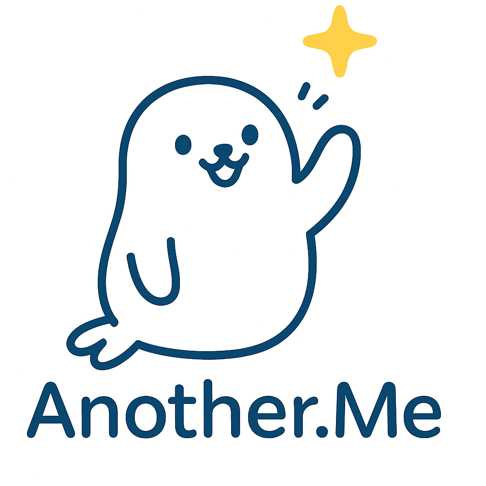
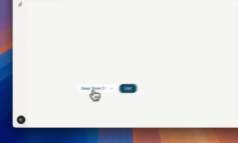
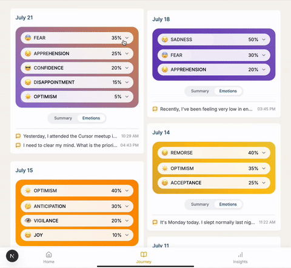
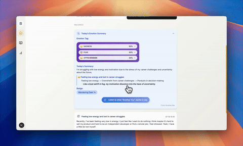
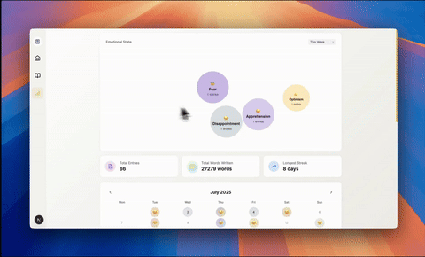

<div align="right" style="font-size:14px;">
  <strong>English</strong> | <a href="README_ZH.md">中文</a>
</div>

<div align="center">
  
  <br/>
  <h1>AnotherMe AI</h1>
  <p><strong>Let AI help you journal better and think clearer</strong></p>
  <p>An intelligent journaling app for personal growth: guided writing, emotion analysis, and visual insights.</p>
  <p><strong>Live:</strong> <a href="https://anotherme.life">anotherme.life</a></p>
  <p><strong>Local Preview:</strong> <code>http://localhost:3000/product</code></p>
  <div>
    
    
    
    
  </div>
  <br/>
</div>

## ✨ Why We Built This

Traditional diaries often begin with a blank page. Yet when you flip back through your old entries, even the smallest details can make you smile — they’re proof of your existence, traces of your life.
One day I thought: what if a diary could be more active? Writing a diary is like looking into a mirror, and I wished that the “other self” in the mirror could do more. It could analyze my real emotions, reveal sides of me I hadn’t noticed, encourage me, hold deep conversations, and guide me toward positive thinking. This would make it easier to keep observing and recording myself, and help me stick to the good habit of journaling. That’s why I created this product.

`AnotherMe AI` AI combines the guiding power of AI with data-driven insights to lower the barrier to journaling and reflection. It’s more than a recording tool — it’s an intelligent companion that talks with you, helps you untangle your thoughts, and uncovers patterns within. With this project, we hope more people can easily embark on their own journey of self-discovery, turning everyday notes into true personal growth.

## 🏗️ Architecture Overview

The project is built on a modern web stack, designed for efficient development and a seamless user experience.

- **Frontend**: Built with the [Next.js](https://nextjs.org/) App Router, using [React 19](https://react.dev/) and [Tailwind CSS](https://tailwindcss.com/) for a dynamic and responsive UI.
- **Backend & Database**: Fully powered by [Supabase](https://supabase.com/) as a Backend as a Service (BaaS).
  - **Database**: Supabase Postgres for core data storage.
  - **Authentication**: Supabase Auth for managing user sign-ins and sessions.
  - **Storage**: Supabase Storage for user-generated files like images (planned).
- **AI Integration**: Leverages Next.js API Routes as a backend proxy to interact with various Large Language Model (LLM) services, including OpenAI, DeepSeek, allowing for flexible AI capability expansion.

## ⚖️ Open Source vs. Hosted Version

- **Open-Source Self-Hosting**: Your data is completely in your hands, offering flexibility and customization. If you have a technical background, using Supabase is sufficient for personal online journaling needs.
- **Hosted Version**: Offers a more complete feature set, such as the five-minute journal template, AI "encouragement and advice," and notebook mode. It's also ready to use, maintenance-free, and comes with a comprehensive security strategy and more refined default configurations.

## 🚀 Core Features (with demos)

1) **Guided AI Writing (structure × depth)**

Description: never face a blank page—smart prompts and questions help you express quickly and go deeper.

<div align="center" style="margin:12px 0;">
  
</div>

Highlights: intelligent prompts | deep thinking | personalized guidance

2) **Emotion Analysis (real‑time understanding)**

Description: detect mood shifts and triggers from text—see why you feel what you feel.

<div align="center" style="margin:12px 0;">
  
</div>

Highlights: real‑time analysis | mood tracking | insights

3) **End‑of‑Day Summary (automatic recap)**

Description: daily AI summaries with key points and reflection prompts (OSS excludes “encouragement & advice”).

<div align="center" style="margin:12px 0;">
  
</div>

Highlights: AI insights | daily reflection | pattern recognition

4) **Timeline Review (rediscover your path)**

Description: revisit your moments and themes with a clean chronological view.

<div align="center" style="margin:12px 0;">
  <video src="https://anotherme-public.oss-cn-shenzhen.aliyuncs.com/am_site/review_notebook_en.webm"
         style="width:100%;max-width:880px;border-radius:12px;box-shadow:0 8px 24px rgba(0,0,0,.12)"
         autoplay muted loop playsinline
         controlslist="nodownload noplaybackrate nofullscreen noremoteplayback"
         disablepictureinpicture></video>
</div>

Highlights: timeline view | memory rediscovery | growth tracking

5) **Emotion Visualization (see your story)**

Description: bubble charts make your emotional makeup visible and talk‑able.

<div align="center" style="margin:12px 0;">
  
</div>

Highlights: interactive viz | emotion bubbles | visual storytelling

## ⚙️ Install & Configure

**Prerequisites**:
- Node.js `18+`
- pnpm `8+`
- [Supabase CLI](https://supabase.com/docs/guides/cli) (for database migrations)

---

**1. Clone & Install Dependencies**

```bash
git clone https://github.com/AllenBei/AnotherMe-AI_Companion_Journal.git
cd AnotherMe-AI_Companion_Journal
pnpm install
```

**2. Configure Supabase**

- Go to [supabase.com](https://supabase.com) and create a new project.
- Find your Project URL and `anon` public key in your project's `Settings` > `API`.
- Link your local repository to your Supabase project using the CLI:
  ```bash
  npx supabase login
  npx supabase link --project-ref YOUR_PROJECT_ID
  ```
  (You can find `YOUR_PROJECT_ID` in your project's URL, e.g., `https://<project-id>.supabase.co`)

**3. Database Migration (Crucial Step)**

Run the following command to push the required database schema to your Supabase project:

```bash
npx supabase db push
```

**4. Configure Environment Variables**

Copy the `.env.example` file in the root directory to a new file named `.env.local` and fill in the values.

```bash
cp .env.example .env.local
```

**Required (Supabase)**

| Variable                               | Description                                      |
| -------------------------------------- | ------------------------------------------------ |
| `NEXT_PUBLIC_SUPABASE_URL`             | Your project URL from the Supabase dashboard.    |
| `NEXT_PUBLIC_SUPABASE_ANON_KEY`        | Your project `anon` public key.                  |
| `NEXT_PRIVATE_SUPABASE_SERVICE_ROLE_KEY` | Your project `service_role` secret key.          |
| `SUPABASE_INTERNAL_API_ADMIN_AUTH_SECRET` | A strong, random string to protect internal APIs.|

**Optional (AI Services)**

The default AI provider is Deepseek. You can switch to other providers by configuring their respective environment variables.

| Variable                             | Description                          |
| ------------------------------------ | ------------------------------------ |
| `OPENAI_API_BASE_URL`                | OpenAI API endpoint URL.             |
| `OPENAI_API_KEY`                     | Your OpenAI API key.                 |
| `OPENAI_MODEL`                       | The OpenAI model name to use.        |
| `DEEPSEEK_API_KEY`                   | Your DeepSeek API key.               |
| `...`                                | Other AI provider variables...       |

**5. Start the Project**

```bash
pnpm dev
```
Now, you can access the app at [`http://localhost:3000/product`](http://localhost:3000/product).

---

**OAuth Login Configuration (Optional)**

- To enable third-party logins (e.g., GitHub, Google), go to `Authentication` > `Providers` in your Supabase dashboard to enable them and add your Client ID/Secret.
- Also, in `Authentication` > `URL Configuration`, set the `Site URL` to `http://localhost:3000` for local development and add it to `Additional Redirect URLs`.

## 📚 Tech Stack

- **Framework**: Next.js, React 19
- **Styling**: Tailwind CSS
- **Animation**: Framer Motion, GSAP
- **Backend & Database**: Supabase
- **UI Components**: Radix UI, shadcn/ui
- **State Management**: Zustand
- **Schema Validation**: Zod

## 🤝 Contributing

Contributions are welcome! Please open a PR with a description, linked issues, and before/after screenshots for UI changes.

## 📜 License

This project is licensed under the **[MIT License](LICENSE)**.

