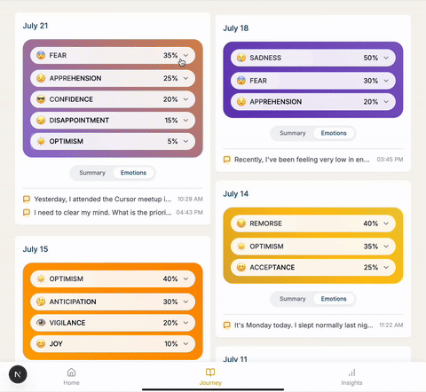

<div align="right" style="font-size:14px;">
  <a href="README.md">English</a> | <strong>中文</strong>
</div>

<div align="center">
  
  <br/>
  <h1>AnotherMe AI</h1>
  <p><strong>让 AI 陪你写更好的日记与思考</strong></p>
  <p>面向自我成长的智能日记应用：引导写作、情绪分析、可视化洞察，一站式提升表达与内在清晰度。</p>
  <p><strong>线上体验：</strong><a href="https://anotherme.life">anotherme.life</a></p>
  <p><strong>本地预览：</strong>启动后访问 <code>http://localhost:3000/product</code></p>
  <div>
    
    
    
    
  </div>
  <br/>
</div>

## ✨ 项目缘起

传统的日记往往始于一张白纸，但你翻到自己曾经写过的日记会会心一笑，哪怕是些鸡毛蒜皮，毕竟这是你存在这个世界的痕迹和记录。
有一天我觉得，也许日记本可以更‘主动’点，写日记本质上就是照镜子，我希望镜子的‘另一个自己’可以做的更多，会分析我的真实情绪和我自己都不知道的一面，会鼓励我，会和我深度对话，会引导我积极的思考；让我更容易去记录和观察自己，不会轻易放弃写日记的好习惯。所以我就写了这个日记产品～

`AnotherMe AI` 结合 AI 的引导能力和数据分析能力，可以极大地降低记录和反思的门槛。它不仅仅是一个记录工具，更是一个能与你对话、帮助你梳理思绪、发现内在模式的智能伙伴。我们希望通过这个项目，让更多人能够轻松地开启自我探索之旅，将日常记录转化为真正的个人成长。

## 🏗️ 架构概览

项目采用现代化 Web 技术栈，旨在实现高效开发与流畅的用户体验。

- **前端**: 基于 [Next.js](https://nextjs.org/) App Router 构建，使用 [React 19](https://react.dev/) 和 [Tailwind CSS](https://tailwindcss.com/) 实现动态、响应式的用户界面。
- **后端 & 数据库**: 全面采用 [Supabase](https://supabase.com/) 作为后端即服务 (BaaS)。
  - **数据库**: Supabase Postgres 用于核心数据存储。
  - **认证**: Supabase Auth 管理用户登录与会话。
  - **存储**: Supabase Storage 用于存储用户生成的图片等文件（规划中）。
- **AI 集成**: 通过 Next.js API Routes 作为后端代理，与多种大语言模型（LLM）服务进行交互，包括 OpenAI、DeepSeek等，实现了灵活的 AI 能力扩展。

## ⚖️ 开源版 vs. 托管版

- **开源自托管**：数据完全在你手上，灵活可定制。如果你有技术基础，使用 Supabase 即可满足个人线上日记需求。
- **线上托管版**：功能更完整，如五分钟日记模板、AI“鼓励与建议”、日记本模式等；其次是即开即用、免运维、具备完整的安全策略与更完善的默认配置。

## 🚀 功能亮点（含动态演示）

1) **AI 引导写作（结构化启发 × 深度思考）**

描述：通过智能提示与引导问题快速进入状态，逐层深入你的真实想法，告别“无从下笔”。

<div align="center" style="margin:12px 0;">
  
</div>

要点：智能提示｜深度思考｜个性化引导

2) **情绪分析（实时理解你的文本情绪）**

描述：基于文本语义识别情绪变化，高亮触发点，帮助你看清“为什么有这种感受”。

<div align="center" style="margin:12px 0;">
  
</div>

要点：实时分析｜情绪追踪｜心情洞察

3) **日终总结（自动生成当天摘要）**

描述：每天为你提炼重点与反思方向，形成连续的成长日志。（开源版不包含“鼓励与建议”）

<div align="center" style="margin:12px 0;">
  
</div>

要点：AI 洞察｜每日反思｜模式识别

4) **情绪可视化（把感受变成“可看的故事”）**

描述：通过气泡图将情绪构成直观呈现，让复杂心绪变得清晰可见与可对话。

<div align="center" style="margin:12px 0;">
  
</div>

要点：交互可视化｜情绪气泡｜视觉叙事

5) **时间轴回顾（记忆与成长的一目了然）**

描述：用时间线重温你的片段与主题，重新发现那些微小但重要的变化。

<div align="center" style="margin:12px 0;">
  <video src="https://anotherme-public.oss-cn-shenzhen.aliyuncs.com/am_site/review_notebook.webm"
         style="width:100%;max-width:880px;border-radius:12px;box-shadow:0 8px 24px rgba(0,0,0,.12)"
         autoplay muted loop playsinline
         controlslist="nodownload noplaybackrate nofullscreen noremoteplayback"
         disablepictureinpicture></video>
</div>

要点：时间线视图｜记忆重拾｜成长追踪

## ⚙️ 安装与配置

**前置要求**:
- Node.js `18+`
- pnpm `8+`
- [Supabase CLI](https://supabase.com/docs/guides/cli) (用于数据库迁移)

---

**1. 克隆与安装依赖**

```bash
git clone https://github.com/AllenBei/AnotherMe-AI_Companion_Journal.git
cd AnotherMe-AI_Companion_Journal
pnpm install
```

**2. 配置 Supabase**

- 前往 [supabase.com](https://supabase.com) 创建一个新的项目。
- 进入项目后台，在 `Settings` > `API` 中找到你的项目 URL 和 `anon` 公钥。
- 使用 Supabase CLI 将你的本地项目与远程项目关联：
  ```bash
  npx supabase login
  npx supabase link --project-ref YOUR_PROJECT_ID
  ```
  (`YOUR_PROJECT_ID` 可以在你的项目 URL 中找到，例如 `https://<project-id>.supabase.co`)

**3. 数据库迁移 (关键步骤)**

运行以下命令，将项目所需的表结构同步到你的 Supabase 数据库中：

```bash
npx supabase db push
```

**4. 配置环境变量**

将项目根目录下的 `.env.example` 文件复制一份并重命名为 `.env.local`，然后填入相应的值。

```bash
cp .env.example .env.local
```

**必需配置 (Supabase)**

| 环境变量                               | 说明                                     |
| -------------------------------------- | ---------------------------------------- |
| `NEXT_PUBLIC_SUPABASE_URL`             | 你在 Supabase 后台找到的项目 URL。         |
| `NEXT_PUBLIC_SUPABASE_ANON_KEY`        | 你在 Supabase 后台找到的 `anon` 公钥。     |
| `NEXT_PRIVATE_SUPABASE_SERVICE_ROLE_KEY` | 你在 Supabase 后台找到的 `service_role` 密钥。 |
| `SUPABASE_INTERNAL_API_ADMIN_AUTH_SECRET` | 建议设为强随机字符串，用于保护内部 API。 |

**可选配置 (AI 服务)**

默认 AI 服务商为Deepseek，你也可以选择其他服务商并配置对应的环境变量。

| 环境变量                             | 说明                                 |
| ------------------------------------ | ------------------------------------ |
| `OPENAI_API_BASE_URL`                | OpenAI API 地址。                    |
| `OPENAI_API_KEY`                     | OpenAI API 密钥。                    |
| `OPENAI_MODEL`                       | 使用的 OpenAI 模型名称。               |
| `DEEPSEEK_API_KEY`                   | DeepSeek API 密钥。                  |
| `...`                                | 其他 AI 服务商的环境变量...            |

**5. 启动项目**

```bash
pnpm dev
```
现在，访问 [`http://localhost:3000/product`](http://localhost:3000/product) 即可开始使用。

---

**关于 OAuth 登录配置 (可选)**

- 如果你需要启用第三方登录（如 GitHub, Google），请前往 Supabase 后台 `Authentication` > `Providers` 启用并填入 Client ID/Secret。
- 同时，在 `Authentication` > `URL Configuration` 中，将 `Site URL` 设为 `http://localhost:3000`（用于本地开发），并在 `Additional Redirect URLs` 中也加入此地址。

## 📚 技术栈

- **框架**: Next.js, React 19
- **样式**: Tailwind CSS
- **动画**: Framer Motion, GSAP
- **后端 & 数据库**: Supabase
- **UI 组件**: Radix UI, shadcn/ui
- **状态管理**: Zustand
- **数据校验**: Zod

## 🤝 贡献

欢迎贡献！请随时提交 Pull Request（请附上变更说明、关联 issue、以及 UI 改动前后截图）。

## 📜 开源协议

本项目基于 **[MIT License](LICENSE)** 开源。